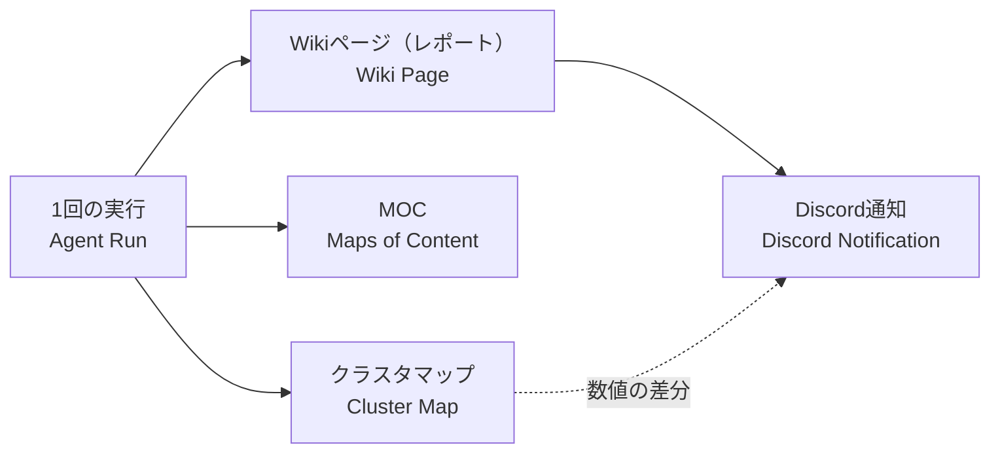

# Alignment - 共有構造と意味の対応 / Shared Structure and Semantics

このファイルは、人間とAIが作っているものの構造を同じ視点で捉え、
要望が「何の、どの側面を、どう変えたいのか」を特定するための共有地図である。

---

## 全体地図 / Project Overview

```text
memoria-forge
├─ 成果物・閲覧 / Frontend
│  ├─ Wikiページ（レポート） / Wiki Page (Report)
│  ├─ MOC / Maps of Content
│  ├─ クラスタマップ / Cluster Map
│  └─ Discord通知 / Discord Notification
├─ 処理・データ / Backend
│  ├─ RSS収集 / RSS Ingestion
│  ├─ 世界地図（幾何エンジン） / World Map (Geometry Engine)
│  ├─ 計画・執筆・レビュー / Planner・Writer・Reviewer
│  └─ 状態DB / State DB
└─ 実行環境 / Infrastructure
   ├─ ローカルLLM（Ollama） / Local LLM
   ├─ 定期実行 / Scheduled Run
   └─ Git自動コミット・push / Git Auto Commit
```

## 領域地図 / Domain Maps

### 成果物・閲覧 / Frontend



```text
1回の実行 / Agent Run
├─ Wikiページ（レポート） ──→ Discord通知（タイトル・結論抜粋）
├─ MOC
└─ クラスタマップ ──(クラスタ数・点・関係の差分)──→ Discord通知
```

### 処理・データ / Backend

```text
RSS収集 → 世界地図（クラスタ） → 計画 → 執筆 → レビュー → Vaultへ書き込み → 状態DB記録
```

### 実行環境 / Infrastructure

```text
run_agent.py（定期実行） → Ollama / Git push / Discord Webhook
```

## 構造と実装の対応 / Structure-to-Implementation Mapping

### Wikiページ（レポート） / Wiki Page (Report)
- **役割 / Responsibility**: RSSクラスタから深掘り調査して書いたテーマ別レポート
- **親 / Parent**: 成果物・閲覧
- **含むもの / Contains**: 結論、テーマ概要、共通点、差分、知見、不確実な点、元記事一覧
- **画面上の位置・利用者からの見え方 / Human View**: `live-vault/10_Knowledge/*.md`（Obsidian）
- **実装 / Implementation**:
  - Files: `src/wiki_agent.py`（`run_once`、`validate_page_content`）
  - State: `runs`テーブル（result=success/expanded）
- **指示に使える表現 / Human Labels**: レポート、Wikiページ、テーマレポート
- **曖昧になりやすい表現 / Ambiguous Labels**: 「レポート」はクラスタマップHTMLも指し得る

### クラスタマップ / Cluster Map
- **役割 / Responsibility**: 意味空間上のクラスタ分布・関係を可視化する
- **親 / Parent**: 成果物・閲覧
- **画面上の位置・利用者からの見え方 / Human View**: `live-vault/cluster-map.html`（Git管理外）
- **実装 / Implementation**:
  - Files: `experiments/visualize_clusters.py`（`generate`はclusters/members/relationsを返す）
- **指示に使える表現 / Human Labels**: マップ、クラスタマップ、B
- **曖昧になりやすい表現 / Ambiguous Labels**: 「HTMLレポート」

### Discord通知 / Discord Notification
- **役割 / Responsibility**: Wikiページ生成時に、タイトル・結論抜粋・マップ差分をDiscordへ送る
- **親 / Parent**: 成果物・閲覧
- **画面上の位置・利用者からの見え方 / Human View**: DiscordチャンネルのWebhookメッセージ
- **実装 / Implementation**:
  - Files: `src/discord_notify.py`、呼び出しは`run_agent.py`の`_run_once_worker`
  - 順序: 作業(`run_once`) → MOC・マップ → `push_pending`（残り変更をコミット＋未pushをpush、結果は`result["git_final"]`） → 通知
  - 表示: 本文先頭に`@everyone`。`git_final.status == "pushed"`のときだけGitHubリンク、失敗時は「⚠️ push失敗: 理由」
  - State: `live-vault/.cluster-map-stats.json`（前回通知時のマップ数値、Git管理外）
  - API: `config/discord_webhook.txt`の1行目（Git管理外。無い・空なら送信しない）。`run_agent.main`が読み、workerへ引数で渡す
- **指示に使える表現 / Human Labels**: Discord通知、Webhook
- **曖昧になりやすい表現 / Ambiguous Labels**: なし

## 用語・概念 / Terms and Concepts

### レポート / Report
- **意味 / Meaning**: 1回の実行で生成されたWikiページ
- **別名 / Aliases**: テーマレポート、Wikiページ
- **NG解釈 / Wrong Interpretation**: 毎回再生成されるcluster-map.html
- **OK解釈 / Correct Interpretation**: `run_once`がsuccess/expandedを返したときのページ

---

## 意味の衝突記録 / Semantic Conflict Log

### 2026-09-14「レポートを作成したとき」
- **対象候補 / Candidate Target**: Wikiページ / クラスタマップHTML
- **ユーザーの意図 / User Meaning**: 価値があり目に見える方
- **AIの解釈 / Agent Interpretation**: 両方の可能性があったため確認した
- **実装上の実体 / Actual Implementation**: Wikiページ生成時に通知し、マップは数値差分を添える
- **現在の解釈規則 / Current Rule**: 「レポート」はWikiページを指す
- **状態 / Status**: resolved

## 未解決の観察 / Unresolved Observations

### 2026-09-14「マップをURLで見て視覚的な更新を楽しみたい」
- **観察 / Observation**: 数値差分より先に、マップ自体を外から見たい要望がある
- **対象候補 / Possible Targets**: クラスタマップ、Discord通知
- **概念候補 / Possible Concepts**: GitHub Pages公開、PNG添付
- **確信度 / Confidence**: medium
- **次に確認すること / Next Question**: 数値差分の通知を運用してみて、画像やURLが欲しくなったか
